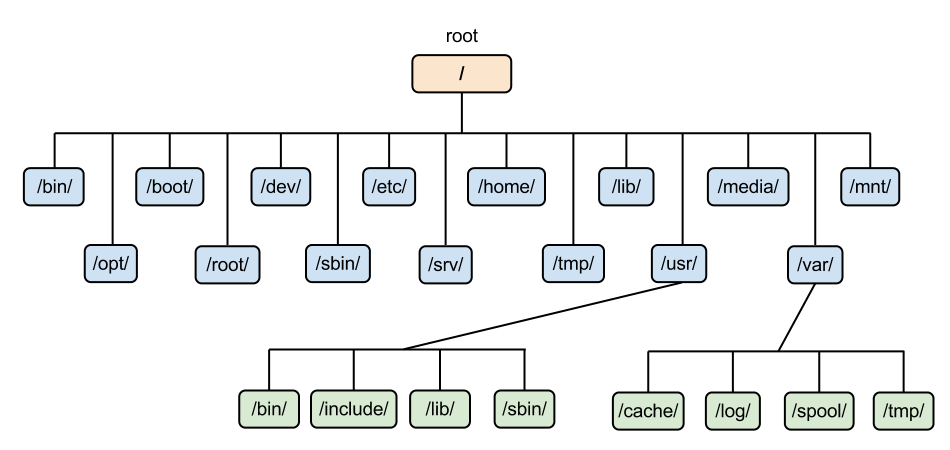

# Documentation

Documentation by Ravenn

*If you see any errors in this documentation, don't hesite to create a push requests on this repo :)*

*It may also contain some spelling mistakes, as english is not my first language...*


---


## **Summary**

**System**
- **[Linux](#linux)**
- **[Docker](#docker)**


**Network**
- **[Network bases](#network-bases)**
- **[Cisco](#cicso)**

---

<!------------------------------------------------ -->
                
## System


### **Linux**

#### **Summary**
- [1. What's Linux ?](#1-whats-linux)
- [2. Distribution](#2-distribution)
- [3. Utility](#3-utility)
- [4. File system](#4-file-system)
- [5. Bash](#5-bash)
- [6. Install application in Linux](#6-install-applications-in-linux)   
    - [6.1 Debian based](#61-debian-based)
    - [6.2 Arch based](#62-arch-based)
- [7. Configure applications in linux](#7-configure-applications-in-linux)
- [8. Scripts](#8-scripts)
- [9. Pipe and redirection](#9-pipe-and-redirection)
- [10. Environnement variables, *, ~ etc...](#10-environnement-variables---etc)
- [11. Services](#11-services)
- [12. Permission](#12-permission)


#### **1. What's Linux ?**
Linux is a open-source OS based on Unix. It's very lightweight and it's the most use OS for running server around the world. The creator of Linux is Linus Torvald.

#### **2. Distribution**
Linux is just the kernel. It's the heart of the OS. There's somethings call distribution in Linux. It's exploatation system using the linux kernel. Each distribution have their own differences and avantages. There's a list of most used distribution in linux :

There's 2 main distribution, Debian and Arch. A lot of distribution are based on this distribution. For example Ubuntu and Mint are Debian based distribution. And Manjaro is Arch based distribution.

Fun fact : Android is linux based. Which make linux the first operating system in the world because android is used by 3,6 Billions of personn.

#### **3. Utility**
Linux is great for running server. More than 90% webserver of the world are debian server or debian based server.

#### **4. File system**
Here is the linux files system : 



Let me explain all this folder. First of all linux use one and only one file system which is "/" even if you plug a external drive in your computer it won't be another file system.

The "/bin/ is not a folder but a link to "/usr/bin".   
The "/opt" is for all optionnal package (application) that you want to install (not realy used).   
The "/boot" store file for the boot loader (grub for example) and other file to boot the PC.   
The "/root" folder is the home partition of the root which is the superuser of linux.   
The "/dev" is where every driver are store.   
The "/sbin" is not a folder but a link to "/usr/sbin".   
The "/etc" folder is where every text configuration file are stored.   
The "/srv" folder is for service.   
The "/home" folder is where every user home is stored.   
The "/tmp" is a folder that contain temporaray file (it clean up after shutdown).   
The "/lib" is a link to "/usr/lib".  
The "/usr" is a folder that contain user file.   
The "/media" is a folder where external drive will be mount.   
The "/var" is a folder that contain different variable.   
The "/mnt" is a folder where you can mount manualy your drive.

In the "/usr" folder, there's other folder like bin, lib and sbin.
The "/usr/sbin" folder contain super-user application (require super-user perm to execute it).   
The "/usr/bin" folder contain application.   
The "/usr/lib" is a folder that contain necessary librairy for linux to run.  

#### **5. Bash**

In linux you can use the terminal for everything. The terminal is just a application. The backend of that application is call "Shell". There's a lot of shell, for example "zsh", "bash", "sh" etc...

The basic one is bash.

Here's a list of command that you can do on linux (debian) : 

|Name|Utility|Syntax|Example|
|-|-|-|-|
|cd|Change direcotry|cd \<directory>|cd /usr/bin|
|ls|List direcotry|ls \<directory>|ls /usr/bin|
|pwd|Show current directory|pwd|pwd|
|touch|Create a empty file|touch \<file>|touch test.txt|
|man|Show the manual of a command|man \<command>|man ssh|
|cp|Copy file to a folder|cp \<source> \<destination>|cp ~/test.txt ~/documents|
|mv|Move file to a folder|mv \<source> \<destination>|mv ~/test.txt ~/documents|
|whoami|Display current user|whoami|whoami|
|rm|Remove file or folder|rm \<file>|rm ~/documents/test.txt|
|mkir|Create direcotry|mkdir \<direcotry>|mkdir test|
|exit|Exit session|exit|exit|
|su|Switch user|su \<user>|su root|
|echo|Return a variable|echo \<variable>|echo $HOME|
|free|Show memory usage|free|free|
|lsblk|Show drive|lsblk|lsblk|
|ln|Create a link to a file or a folder|link \<source> \<destination>|ln test.txt /opt/test.txt|
|kill|Kill a processus|kill \<pid>|kill 1442|
|sudo|Execute with superuser|sudo \<command>|sudo pwd|
|which|Show the path of a command|which \<command>|which curl|
|type|Show information about a commmand|type \<command>|type cd|
|apropos|Search in the manual|apropos \<search>|apropos partition|
|alias|Create a alias|alias \<nom>="\<command>"|alias clear="clear && neofetch"|
|unalias|Remove a alias|unalias \<aliasName>|unalias clear|
|grep|Search a string in a file|\<command>\| grep \<string> |cat .bashrc \| grep "bash"|
|cat|Concat multiple file together|cat \<file> \<file> |cat text.txt test2.txt|
|sort|Sort a file|sort \<file> |sort test.txt|
|uniqu|Return unique value of a file|uniqu \<file>|unqiq file.txt|
|wc|Give information about file|wc \<file>|wc file.txt|
|head|Show x number of line of a file|head -n \<numberLines> \<file>|head -n 5 test.txt|
|tail|Show x number of line of the bottom of a file|tail -n \<numberLines> \<file>|tail -n 5 test.txt|
|chmod|change permission of a file|chmod \<type>\<sign>\<perm> \<object>|chmod u+wr test.txt|
|chown|change owner of a file|chown \<user> \<object>|chown root .bashrc|
|chgrp|change group owner of a file|chgrp \<groupe> \<object>|chgrp sudo .bashrc|


You can get information about any command by typing : 

```bash
<command> --help
```

#### **6. Install applications in Linux**

Install applications in linux is different in every distribution, for example in ubuntu you have what's called the snap store which contain a lot of application to install. But you rarely install applications via this store. In linux you can use the terminal to do everything. Here's how to install application in the most used distribution.

##### **6.1 Debian based**

In linux we use what's called "Package manager" it's a software that download, store and manage app via a simple command. In debian :

To install applications:
```bash
$ sudo apt install <package>
```

In debian you can also download manualy the package which are .deb and use dpkg to install it (dpkg don't install dependencies, apt does)

```bash
$ sudo dpkg -i <package>
```

To uninstall applications : 
```bash
$ sudo apt remove <package>
```


##### **6.2 Arch based**

In arch the package manager is called "Pacman"

To install applications :
```bash
$ sudo pacman -S <package>
```

To uninstall applications :
```bash
$ sudo pacman -R <package>
```

#### **7. Configure applications in linux**
In Linux every config are store in /etc and it's text file. So you can edit every configs files just by opening them. Here's how to config a simple ssh server in linux.

First of all we need to download a text editor. Depends on your distribution you may already have one like nano, vi, vim...   
I personnaly recommend "vim" it's fast, simple and very cool ! To download it type this command (debian) : 

```bash
$ sudo apt install vim
```

After this download the ssh server :

```bash
$ sudo apt update
$ sudo apt install openssh-server ssh
```

Now you have installed ssh you can configure it by using this command :

```bash
$ sudo vim /etc/ssh/sshd_config
```
You can now press "i" to enter into the insert mode.

And now you can edit every parameter that you want don't forget to type "ESC + : + wq" to quit and save you change made by vim ! 

#### **8. Scripts**
In linux you can create scripts to do some actions automaticly. For example imagine that you want to create a file, append some content into it and then show the content of the file. You can create a script to do it. Just create a file call "your_script.sh" and then use a text editor to write into it. Here's how the script is make : 

```bash
#/usr/bin/bash

touch test.txt # Create the file
echo "Hello world !" >> test.txt # Add content into it
cat test.txt # Show the content of the file.
```

Then you can type this command to make it executable : 

```bash
$ sudo chmod +x script.sh
```

And then you can run it by this command : 

```bash
$ ./script.sh
```

You can use variables in bash script to create a variable you need to put a "$" before the name of the variable :

```bash
#/usr/bin/bash
$hello = "Hello world!" # Create a variable that contain the string "Hello world!"

echo $hello # Print the content of the variable on the screnn
```

You can also use positioning variable so when you're using you script you can add parameter :

```bash
#/usr/bin/bash

echo $0 # Print the parameter
```

So when you're running your script like this :

```bash
$ ./script.sh "Hello world"
```

If you use double quote a dollard will be view as a variable.

```bash
echo "$0"

output : /bin/bash
```

To use a dollard as a character you can put a \ (echappement character) infront of it or you can use simple quote.

```bash
echo '$0'

output : $0
```

You can use the script command to save all the command that you type.

```bash
script

ls -la

pwd

exit
```

Exit command is use to end the scripting.

#### **9. Pipe and redirection**

You can reddirect the output of a command into a file :

```bash
$ cat .bashrc >> hey.txt 
```

You can also reddirect the output to another command with a pipe :

```bash
$ cat .bashrc | grep "txt"
```

We can send the normal output and the error output differently : 

```bash
$ ls >> test.txt 2> error.txt # We send the ls ouput to test.txt and the error output into error.txt
```

We can hide the output :

```bash
$ ls >> /dev/null
```

#### **10. Environnement variables, *, ~ etc...**

There's different sign in bash that can be used to do different actions.

The \* sign mean "all" you can use it to list all the files from a folder.

```bash
ls /etc/ssh/.conf
``` 

In this example we list all the file from /etc/ssh that end with a .conf 

The ~ sign is the home of the current user.

```bash
cd ~
```

In this example we change our directory to the home directory

We can set a environnemental varibles with the export command.

```bash
export test=10
```

In this example we create a variable and give it a value, then if we echo the variable. 

```
echo $test

output : 10 
```

We can set a array of number with the {} sign.

```bash
echo "test"{1..2}

output : test1 test2
```

We can run command as a variable.

```bash
echo $(ls)

output : ls as a string
```

#### **11. Services**

You can create a services in linux by editing a file in /etc/systemd/system/. Here's the syntax for basic services :

```bash
[Unit]
Description=Minecraft Service # Description of the services

[Service]
ExecStart=./$HOME/mcserver/start.sh # Executing command 

[Install]
WantedBy=multi-user.target
```

We can know reload systemd :

```bash
$ sudo systemctl daemon-reload
```

And then enable our service :

```bash
$ sudo systemctl enable minecraft.service
```

Then you can check the status of the service by typing :

```bash
$ systemctl status minecraft.service
```

#### **12. Permission**

Permission on linux work like that.

```bash
ls -la 

output :
drwx------  3 root root 4096 Jul  4 11:28 .
drwxr-xr-x 18 root root 4096 Nov 17 12:51 ..
-rw-r--r--  1 root root  571 Apr 10  2021 .bashrc
```

In a line you have a lot of information about permission. Let's decompose that.

-rw-r--r--  1 root root  571 Apr 10  2021 .bashrc   

The first part is the permission of the file. The first part is the owner of the file permission. The second part (root root) is the user owner and the second is the group owner. The last part is about all other user.

To change permission you can use the chmod.

```bash
chmod o+wr .bashrc
# Change permission for other all other user (non-owner) to read and write
```

You can use with the number instead.

```bash
chmod 777 .bashrc
# Change permission for all user to read, write and exec.
```

```bash
chmod 764 .bashrc
# Change the permission to rwx for the owner, to rw for the group owner and only read for other
```

##### **Table of octal permission**

|   Octal  |    Binary  |   Mod   |
|    -     |      -     |    -    |
|    0     |     000    |   NULL  |
|    1     |     001    |    x    |
|    2     |     010    |    w    |
|    3     |     011    |    wx   |
|    4     |     100    |    r    |
|    5     |     101    |    rx   |
|    6     |     110    |    rw   |
|    7     |     111    |    rwx  |

You can change the default permission that new folder get when create in a directory. This is possible by changing the "umask".

To show the umask you can use this commande

```bash
umask

output : 0022
```

##### **Umask**

The umask is a 4 part number compose by all the permission. 

The fist one is always 0 follow by the permission of the octal permission table.

Example :

```bash
umask 0000
# change default permission to rwx to all.
```

Be careful the umask is inversed.

---

<!------------------------------------------------ -->


### **Docker**

#### **Summary**

- [What's docker ?](#1-whats-docker)
- [2. Install docker on different plateforme](#2-install-docker-on-different-plateforme)
    - [2.1 Install docker on debian base](#21-install-docker-on-debian-base)
    - [2.2 Install docker on windows](#22-install-docker-on-windows)
- [How to use it ?](#3-how-to-use-it)
- [Install MySQL with docker](#4-install-mysql-with-docker)

#### **1. What's docker ?** 

Docker is a software that can install software with his proper environnement (linux based). It's make easier to install/manage/delete services on a server for example. Docker doesn't use virtual elements, he use the hardware of his host. So it make him faster and stronger that a virtual machine.

#### **2. Install docker on different plateforme**

##### **2.1 Install docker on debian base**

To install it on debian base just use apt : 

```bash
sudo apt install docker
```

Depend on the version of your debian you may want to use this :   

https://docs.docker.com/engine/install/debian/

##### **2.2 Install docker on windows**

To install it on windows just go to docker official website and download the .exe file :
https://www.docker.com/

Lauch it and do the basic installation.

#### **3. How to use it ?**

To use docker just open a terminal. And type :   
(It's the same command for windows/linux just don't use the sudo on windows)

```bash
sudo docker --help
```

It will display the docker help.

To install a service with docker you need to download the image, you can go on docker hub to find the image that you want. To download it just use the pull command.

```bash
sudo docker pull image:flag
```

The image is the image of the service that you want to pull, and the flag is basicly the version of the image that you want to download. If you don't put any flag, it will install the latest version.

After downloading the image you need to create a docker instance, it will create the environnement for the service and the service. To do it use the run command.

```bash
sudo docker run --name <name_of_your_instance> --restart=<when_the_service_need_to_restart> -d <name_of_the_image>
```

What this command does ? It create a instance with a name and config the condition for the instance to restart. The '-d' is for --detach, it make the container to run in the backgroud.

If you don't know the name of your image you can type this command :

```bash
sudo docker images
```

And you have install a docker container, bravo ! Now we are going to install MySQL to make a example.

#### **4. Install MySQL with docker**

First of all we need to download the image of mysql to do this run this command : 

```bash
sudo docker pull mysql
```

After this we will need to create the instance for the mysql container. To do this run this command :

```bash
sudo docker run --name mysql --restart=on-failure -p 10.205.201.110:3306:3306 -e MYSQL_ROOT_PASSWORD=1234 -d mysql
```

We add a thew paramets let me explain... 

The -p is for the ip that your container will have. So when you are going to connect into the database you will type "10.205.201.110" the first port (pc port to the container) is the external port, and the second is the internal port (container port to the service).

The -e is for environnement variable. Here we add a password for the root.

After create the instance we can connect to the database. But before we can check if the container is running.

```bash
sudo docker ps -a
```

If the container is not running type this command :

```bash
sudo docker start mysql
```

To connect to the database use this command :

```bash
sudo docker exec -it mysql mysql -u root -p
```

To explain the command : 

We execute a command into our container the command is : 

```bash
mysql -u root -p
```

And the command :

```
sudo docker exec -it mysql
```

Is for executing a command into our container.

After being connect into the database you can change the password with this command : 

```sql
alter user 'root'@'localhost' identified by 'Pa$$w0rd';
```

To apply the modification just type this command to restart the container : 

```bash
sudo docker restart mysql
```

And there you have installed a docker container for mysql !

---


<!------------------------------------------------ -->


## Network


### **Network bases**

#### **Summary**

- [1. Basics](#1-basics)
    - [1.1 Network](#11-network)
    - [1.2 IP address](#12-ip-address)
    - [1.3 Subnet mask](#13-subnet-mask)
    - [1.4 Mac address](#14-mac-address)
    - [1.5 Gateway](#15-gateway)
    - [1.6 Lan, wan etc...](#16-lan-wan-etc)
    - [1.7 Port (logical)](#17-port-logical)
    - [1.8 DNS](#18-dns)
    - [1.9 DHCP](#18-dhcp)
    - [1.10 TCP/IP & OSI model]()
- [2. Network devices]()
    - [2.1 Cables]()
        - [2.1.2 Ethernet, FastEthernet...]()
        - [2.1.2 Fiber]()
    - [2.2 Networt adapter]()
    - [2.3 Router]()
    - [2.4 Firewall]()
    - [2.5 Switch]()
- [3. Network concept]()
- [3.1 Network topology]()
- [3.2 Device link]()
- [3.3 Vlan]()
- [4. Others small network concept]()
- [4.1 Broadcast storm]()
    
#### **1. Basics**

Networking is a important subject in IT. Without him we could not communicate with each other. With network you can deploy your own server, application and others.

##### **1.1 Network**
So what's a network ? A network is a combination of device that can communicate or not with each others. To create a simple network just connect 2 computer with a cable and you can communicate, right ? Yes but no. You will need an address to send your data to the other computer. And that's the next subject.

##### **1.2 IP address**

So what's an IP address ? This is basicly the address of your device on your network. Let's imagine a network with 2 device. One is a computer name "PC01" and an other computer name "PC02". If PC01 need to send data to the PC02 he'll need a address. So what's the address of that computer ? It's your choice you can choose what you want. But in most network an address look like this : 192.168.1.1

The IP address version 4 (IPv4) which is the most common IP address type is composed of 4 part of decimal. Each part is composed of 8 bit. So the range is from 0 to 255.

So now let's connect our 2 device. So I assign the IP addr "192.168.1.10" to my first computer and for the second computer I assign "192.168.1.11".

So now we can communicate ? But my computer is asking for a "Subnet Mask", is it important ?

##### **1.3 Subnet mask**

The subnet mask is a IP that look like a basic one but that is not use like an address. The subnet mask let you segment your network. Let's take a example

I have 2 computer. One is name PC01 and the other is name PC02. I assign the IP 192.168.1.10 to the first one and the IP 192.168.1.11 to the second one. Then we need to assign a subnet mask. So I assign on both computer the mask "255.255.255.0". So can they now communicate ? Yes, they can. But what would append if I assign the subnet mask "255.0.0.0" to the second computer ? Can they still communicate ? No, because they're not in the same network anymore. Why's that ? For understand we need to dig into subnets and segmentation.

Let's take a basic IP : 192.168.1.10 and let's convert it into binary. This would look like this :

1000 0000 / 1010 1000 / 0000 0001 / 0000 1010

So now it's in binary and what ? To understand let's convert our mask (255.255.255.0) into binary

1111 1111 / 1111 1111 / 1111 1111 / 0000 0000

So now we can understand how mask work. All the 1 are what's call the "*network part*". And the part with 0 is what we call the "*hosts part*". The host part is the part where you can assign IP for device. In this case we can assign 256 IP (actually only 254 for common device but we'll talk about that later), so in this case there's 256 IP for the device. And the other part ? It's just for the network you can use them for device. But let's imagine that I need more IP. We can take a part of the network one to assign more IP, and how we do that ? By the subnet mask !

So we can now take 8 bit of the network part, so now our mask look like this :

1111 1111 / 1111 1111 / 0000 0000 / 0000 0000

In decimal : 255.255.0.0

So now we can use our ip adress from 192.168.0.0 to 192.168.255.255 instead of 192.168.1.0 to 192.168.1.255. So now that you have understand subnet mask we can talk about class.

So what're the class ? The class are basic subnets mask and IP convention that are use in most network. The IP 192.168.1.x/24 (/24 is the CIDR value, it's all the 1 in the subnet mask so /24 is 255.255.255.0) is what we call a *class C* it's composed of 192.168 and any number that you want between (1-255) and in last position the host part (compose of 256 IP). They're a few class but 3 are realy use. The C, B and A. The B is a IP address that look like this 172.(16-31).x.x/16, so it's composed of 16 bit of host part (represend by the x). And the A class that look like this 10.x.x.x/8.

The class are use for private network, it means that public IP will never be a class. But we will talk about that later. 

So to make sure that you have understand this. Let's take a example : we have 2 computer with the IP 10.204.123.2/16 and 10.204.53.11/16. Can they communicate ? 

The answer : No because they are not in the same network (10.204.123.x and 10.204.53.x).

##### **1.4 Mac address**

The MAC address is the physical address of a device, like IP address it must be unique in the network. MAC address are use to communicate between device. The MAC address is compose of 6 bytes part. 

##### **1.5 Gateway**

The gateway is a device that give you the path to a specific address. In most of the case it's your router. The router make the route to the internet. Without it you can't communicate with others networks (like internet or other network).

##### **1.6 Lan, wan etc...**

So they're differents type of network. The most basic one that everyone has in their house is a LAN. 

LAN mean *Local area network* it's the combination of your local device in a network. 

The second one is what we call the WAN.

WAN mean *Wide area network* it's basicaly a network that you are connected to that provides you a access to the internet. For example you have your lan at home connected to the network of your ISP (Internet service provider). And for you the ISP network is a WAN.

And there's other types of network that aren't realy important that I'll list here :

MAN mean *Metropolitan area network*
PAN mean *Personnal area network*
WLAN mean *Wireless local area network* (wifi)
VLAN mean *Virtual local area network* (for switch and router)

##### **1.7 Port (logical)**

In network we combined IP address with ports. Ports are a number between 1 and 65535 (16-bit integers). We use port to redirect packets on the good protocoles or services. Let's take a example. We have a computer that want to access to a website host on a server. His IP is 51.12.333.21. If we make a request to server server, he will send packets back. But he need to know which packets he need to send. So we make a request on the ip 51.12.333.21 with the port 80 (http default port). And now the server know that he need to send http packets to the client.

###### **1.7.1** Basics ports

There're some default ports for service. In many cases, we change them for security reason. But it's always great to know the basics ones.

| Port  | Service  |
|   -   |    -     |
|   20 and 21  | FTP |
|   22  | SSH |
|   23  | Telnet |
|   25  | SMTP|
|   37  | NTP |
|   69  | TFTP |
|   80  | HTTP |
|   443 | HTTPS |

All the others ports are list here : *https://en.wikipedia.org/wiki/List_of_TCP_and_UDP_port_numbers*

##### **1.8 DNS**

DNS mean "*Domain name server*", in the IP (Internet Protocole) we use only IP address to access a device. But IP address are hard to remember, and it would be impossible to remember the IP of all website in the world. So we create domaine name. You know a lot of domains names like google.com or wikipedia.org. So instead of using IP to connect into the website, we use the domain name. But we need to translate this domain name into a IP.

And this is why they're DNS. A DNS is just a server with a hudge database that contains all the domaine name and the IP where they point at. 

They are what we call the "*root dns*. They are the DNS server at the top. They contains all the domains names of the world. In current date (2023), they are 13 root dns all around the world. The root dns will distribute changes to the others dns server that are call the "*slaves dns*". Slaves DNS are dns that contains domain name but syncronise their databases with the root dns.

##### **1.8 DHCP**

To assign a IP address there're 2 two to do it. The first one is by assign a IP manualy. But this method would be pain if you would need to assign IP for a lot of device. So there's what we call DHCP server. DHCP stand for Dynamic Host Configuration Protocol. You can install a DHCP service that will provides IP automaticly to computer connected on your network. DHCP server has a few adventage, like the possibily to set what we call a lease time to controll the duration of the IP attribution. It also let you reserve IP or exclude IP.


<!------------------------------------------------ -->


***

Mail : ravenn76@proton.me

Discord : ravenn766


